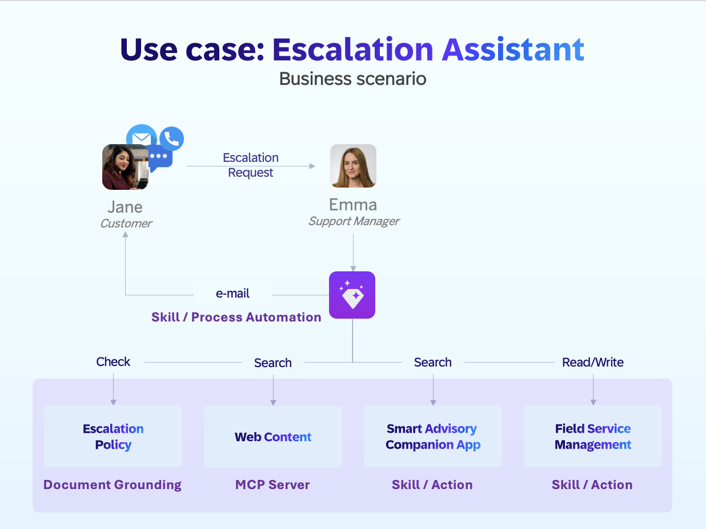
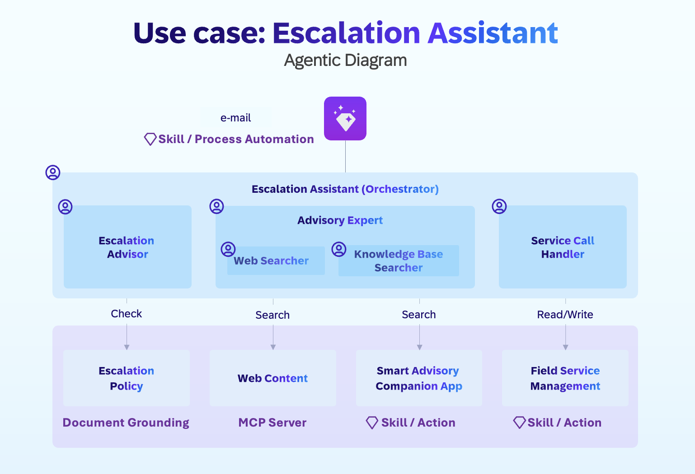

# Escalation Assistant

## Use Case

The process starts with Jane, the customer, who interacts with the company through multiple channels, such as e-mail, chat or phone…
 she sends an escalation request to Emma, the support manager.
Here are Emma's routine tasks to handle an escalation request.  
 
Emma needs to  checks and qualifies the associated incident against the company’s escalation policy. If qualified, Emma drafts and sends a quick response email to reassure the customer or quickly finds a solution by searching the web and internal knowledge base about the relevant topic and respond the customer with the solution via an email. Additionally, as part of the escalation policy, if the incident priority is low or medium, she can increase it high to notify the responsible and the customer about the escalation.
 
Instead of manually performing these tasks, Emma asks help from the Escalation Assistant agent in Joule, which now takes care of the end-to-end process on her behalf.

- Policy is checked using document grounding.
- web search through MCP servers…
- Knowledge base search and Incident ticket are handled through Joule skills and actions…
- Emails are sent by a process automation within a skill

## Agentic Diagram

The design of Escalation Assistant follow the principle of modular multiple agent system. Each AI Agent is specialized in a specific task. The root agent Escalation Assistant act as orchestrator, responsible for orchestrating the other agents in collaborating together towards the end goals.
  
 Here list the agents of Escalation Assistant. Click each item to find out its configurations in Joule Studio, such as expertise, instructions etc. which can be replicated in your own Joule Studio.

AI Agent | Description | Role | Used by
---------|----------|----------|----------
[Escalation Assistant](agent-builder/ESCALATION_ASSISTANT.md) | Orchestrating the other three sub agents | Root Agent | Entry Point
[Escalation Advisor](agent-builder/ESCALATION_ADVISOR.md) | Checking company policy | Sub Agent | Escalation Assistant
[Advisory Expert](agent-builder) | Providing a straightforward solution by leveraging another two sub agents: the Web Searcher and Knowledge Base Searcher | Sub Agent | Escalation Assistant
[Web Searcher](agent-builder/WEB_SEARCHER.md) | Searching the web with the generated query | Sub Agent | Advisory Expert
[Knowledge Base Searcher](agent-builder/KNOWLEDGE_BASE_SEARCHER.md) | Searching the knowledge base with the generated query| Sub Agent | Advisory Expert
[Service Call Handler](agent-builder/SERVICE_CALL_HANDLER.md) | Retrieving and updating service calls | Root Agent | Escalation Assistant

## Replicate to Your own Joule Studio

### Agent Builder

We are working on a simplified version of Escalation Assistant with minimal dependence, which allows you to import its MTAR file. Please stay tuned. Nevertheless, you can have a look at the configuration of AI agents such as expertise, instructions etc. in [Joule Studio Agent Builder](agent-builder).

### Code Editor

We have also exported a version of [Joule Studio code editor](code-editor), which you can edit with the [code editor plug in](https://help.sap.com/docs/joule/joule-development-guide-ba88d1ec6a1b442098863d577c19b0c0/pro-code-development-tools-for-joule?version=CLOUD&locale=en-US).
