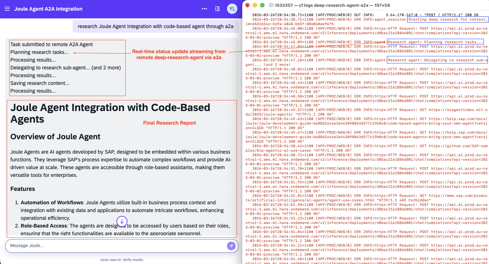
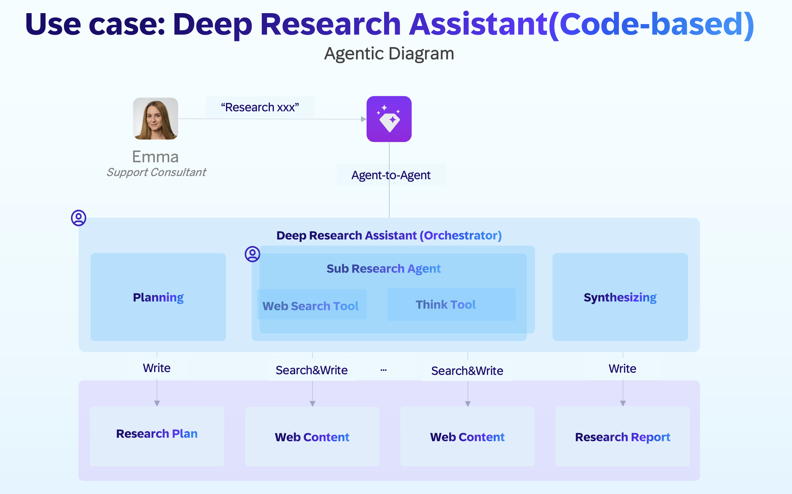

# Joule integration with Code-based Agent

This sample demonstrates external code-based agent integrate with SAP Joule through **A2A**(Agent-to-Agent) protocol and **REST API(synchronous and asynchronous)**, as well as how to build code-based agent with **SAP Generative AI Hub** via **SAP Cloud SDK for AI** in conjunction with popular agent frameworks, such as LangGraph, DeepAgents SDK etc.

## Use Case

Deep Research Agent autonomously plan research on a given research topic, break down tasks into multiple research requests, delegating to multiple sub-agents for simultaneous research, gathering information with web search tool, reflecting on the results, and returning their results to the orchestrator upon completion.

Finally, the orchestrator synthesizes the research results from the sub-agents and compiles a final research report in the desired format.

## Agentic Diagram

 Here list the code-based agent of Deep Research Agent. Click each item to find out its configurations, such as expertise, instructions etc. which can be replicated in your own Joule Studio.

AI Agent | Description | Role | Used by
---------|----------|----------|----------
[Deep Research Agent](./deep_research_a2a/app/agent.py) | Planning research, Orchestrating the sub research agent for multi-step research, Synthesizing the research report | Root Agent | Entry Point
[Research Agent](./deep_research_a2a/app/research_agent/) | Research and collect information for a give research topic with web search | Sub Agent | Deep Research Agent

## Joule Integration with Code-base Agent

### Options 1: Joule integration with Code-base Agent via A2A

Check out the sample of [deep_research_a2a](./deep_research_a2a/) about integrating Joule with Deep Research Agent via A2A. Known limitation as **1 minute of request timeout**.

### Options 2: Joule Integration with Long-running Code-based Agent through async REST API

Check out the sample of [deep_research_api](./deep_research_api/) about integrating Joule with long-running Deep Research Agent via through async REST API. Known limitation as **5 minute of request timeout**.

### Options 3: Joule Integration with Code-based Agent via intermediate A2A Client Service with Streaming mode

Check out the sample of [a2a_client_service](./a2a_client_service/) about integrating Joule with Deep Research Agent via an intermediate A2A Client Service with **Streaming** mode
