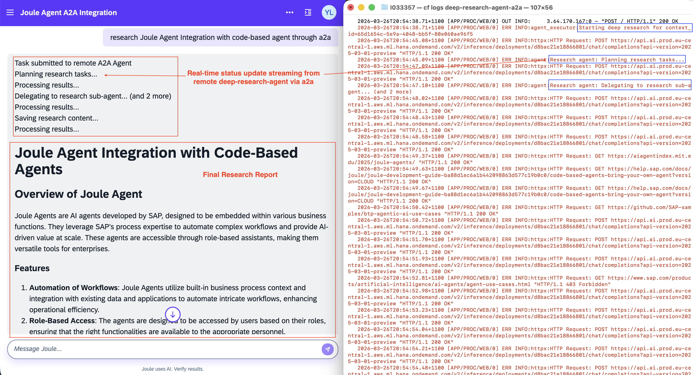
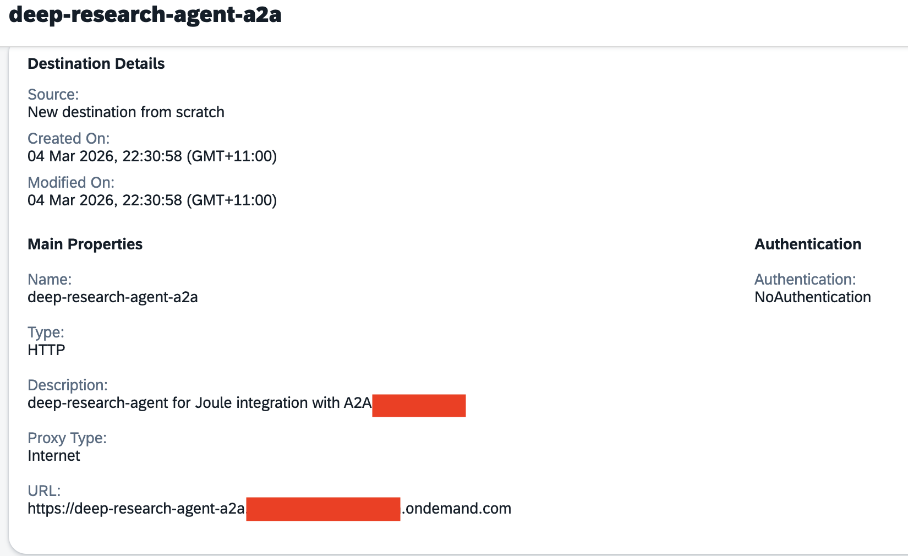
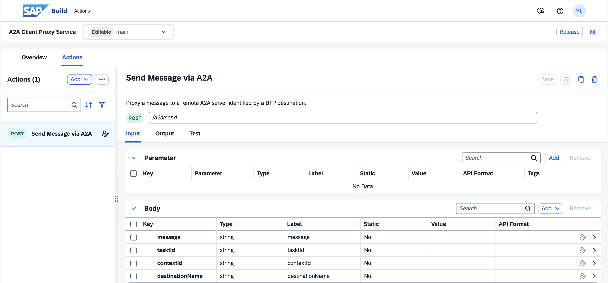
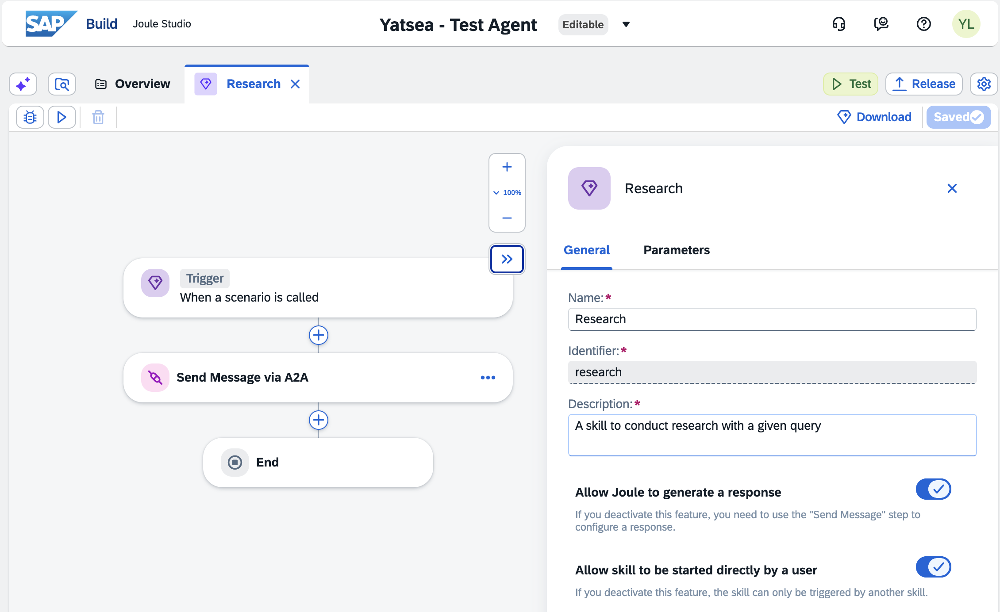
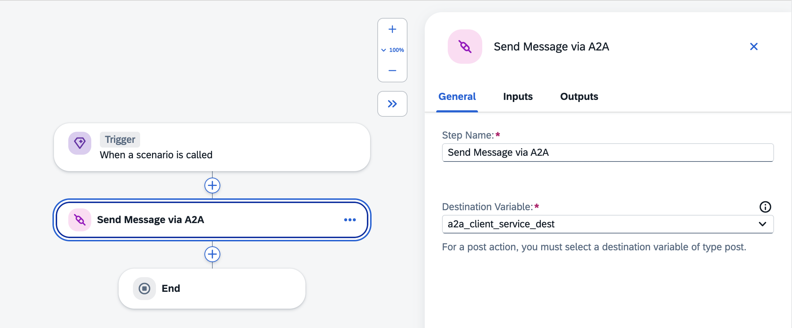
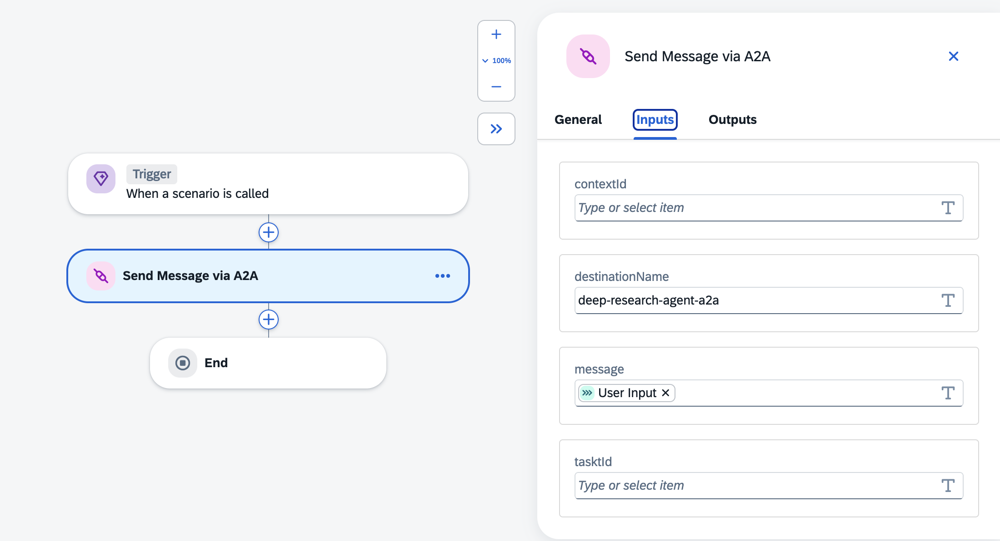
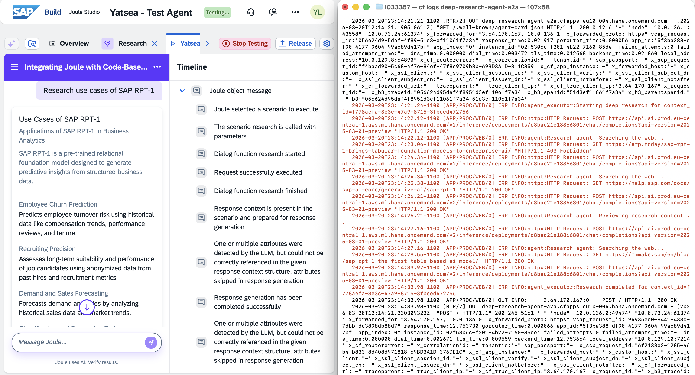
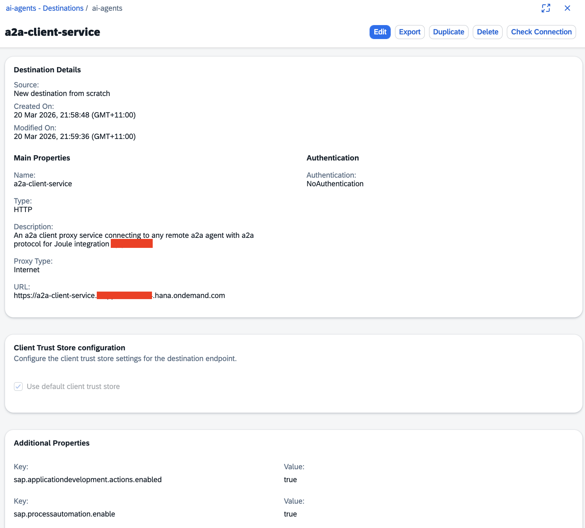

# A2A Client Service

A stateless **Fastify** REST proxy that routes messages to any remote [A2A](https://google-a2a.github.io/A2A) server on the fly, enabling Joule Agent to integrate external AI agents through a2a in **streaming mode** with enterprise-grade security. The target A2A Agent server URL and authentication credentials are resolved at request time from a named **SAP BTP Destination Service** entry, so no credentials are ever hard-coded or revealed in the service.


## Why?

- A2A is already supported by Pro-Code Joule Capability with [Joule Studio Code Editor](https://help.sap.com/docs/joule/joule-development-guide-ba88d1ec6a1b442098863d577c19b0c0/joule-development?locale=en-US) via [Agent Request Action](https://help.sap.com/docs/Joule_Studio/45f9d2b8914b4f0ba731570ff9a85313/2f9701e60fd24e948c2c74fe9e55ce23.html?locale=en-US), however, streaming is not supported in Agent Request Action.
- [Streamed Message Action](https://help.sap.com/docs/Joule_Studio/45f9d2b8914b4f0ba731570ff9a85313/70e471d4234b41e6b9b2b049fb0b514a.html?locale=en-US#loio70e471d4234b41e6b9b2b049fb0b514a__subsectiontitle_hmp_jys_pgc) doesn't support A2A streaming.
- A2A integration isn't available in Joule Studio Agent Builder.

Therefore, I have built this A2A Client Service to bridge these gaps for enabling

- Pro-Code Joule Agent integration with remote A2A Agent in **streaming mode**
- Low-Code No-Code(LCNC) Joule Agent integration with remote A2A Agent through REST API and Action.

## Architecture

```
┌──────────────────────────────────────┐
│         API Client / Agent           │
│  POST /a2a/send  { destinationName,  │
│                    message, … }      │
└──────────────────┬───────────────────┘
                   │  HTTP / JSON
                   ▼
┌──────────────────────────────────────┐
│       a2a-client-service (Fastify)   │  src/server.ts
│  POST /a2a/send                      │
│  POST /a2a/stream (streaming mode)   │
│  GET  /health                        │
└──────────────────┬───────────────────┘
                   │
                   ▼
┌──────────────────────────────────────┐
│   SAP BTP Destination Service        │  src/destinationAuth.ts
│   (@sap-cloud-sdk/connectivity)      │
│                                      │
│   BasicAuthentication                │
│   OAuth2ClientCredentials            │
│   OAuth2JWTBearer                    │
└──────────────────┬───────────────────┘
                   │  Auth
                   ▼
┌──────────────────────────────────────┐
│   A2A Client (@a2a-js/sdk/client)    │  src/a2aProxy.ts
│   ClientFactory + authFetch          │
│                                      │
│                                      │
└──────────────────┬───────────────────┘
                   │  A2A
                   ▼
┌──────────────────────────────────────┐
│         Remote A2A Server            │
│                                      │
│                                      │
│                                      │
└──────────────────────────────────────┘
```

## Key Files

| File | Purpose |
|------|---------|
| `src/server.ts` | Fastify server — endpoints (`/a2a/send`, `/a2a/stream`, `/a2a/stream_normalised`), JWT extraction, SSE streaming, event normalization |
| `src/a2aProxy.ts` | A2A `ClientFactory` with auth-injected `fetch`, streaming support |
| `src/a2aProxyHttps.ts` | Native HTTPS-based SSE streaming (reliable alternative to `fetch`) |
| `src/destinationAuth.ts` | BTP destination resolution + `buildHeadersForDestination` |
| `manifest.yaml` | Cloud Foundry deployment manifest |
| `.env.example` | Local development environment template |

## API

### `GET /health`

Liveness probe. Returns `200 OK` — used by CF health checks.

```json
{ "status": "ok" }
```

### `POST /a2a/send`

Proxy a message to a remote A2A server identified by a BTP destination. Returns the complete response after the agent finishes processing (blocking).

**Request body**

| Field | Type | Required | Description |
|-------|------|----------|-------------|
| `destinationName` | `string` | ✅ | Name of the SAP BTP destination to the remote agent |
| `message` | `string` | ✅ | Plain-text message to send to the remote agent |
| `messageId` | `string` | ❌ | A2A message ID (auto-generated UUID when omitted) |
| `contextId` | `string` | ❌ | A2A context ID to continue an existing conversation |
| `taskId` | `string` | ❌ | A2A task ID to associate with an existing remote task |

**JWT propagation for OAuth2JWTBearer destinations**

The service extracts the caller's JWT using the following priority:

1. `Authorization: Bearer <token>` — standard OAuth2 bearer header.
2. `X-user-token: <token>` — SAP BTP platform propagation header (fallback).

The JWT is forwarded to the BTP Destination Service, which exchanges it for an outbound token for `OAuth2JWTBearer`-typed destinations.

**Response**

Raw A2A response — either a [`Message`](https://google-a2a.github.io/A2A) or [`Task`](https://google-a2a.github.io/A2A) JSON object returned by the remote server.

**Example**

```bash
curl -X POST http://localhost:3000/a2a/send \
  -H "Content-Type: application/json" \
  -H "Authorization: Bearer <your-jwt>" \
  -d '{
    "destinationName": "MY_A2A_SERVER_DEST",
    "message": "What is the weather in Berlin today?",
    "contextId": "session-abc-123",
    "taskId": "task-abc-123"
  }'
```

### `POST /a2a/stream`

Stream real-time updates from a remote A2A server as Server-Sent Events (SSE). Ideal for long-running tasks where you want to receive progress updates as they occur.

**Request body**

Same as `/a2a/send` (see above).

**Response**

Server-Sent Events (SSE) stream with raw A2A protocol events:
- `task` - Initial task creation
- `status-update` - Progress updates with agent messages
- `artifact-update` - Generated artifacts (e.g., reports, files)

Each event is sent as:
```
data: {<A2A event JSON>}\n\n
```

**Example SSE frame sequence:**

```
data: {"kind":"task","id":"...","status":{"state":"submitted"},...}

data: {"kind":"status-update","taskId":"...","status":{"state":"working","message":{...}},"final":false}

data: {"kind":"artifact-update","taskId":"...","artifact":{"artifactId":"...","name":"research_report","parts":[...]}}

data: {"kind":"status-update","taskId":"...","status":{"state":"completed"},"final":true}
```

**Example**

```bash
curl -X POST http://localhost:3000/a2a/stream \
  -H "Content-Type: application/json" \
  -H "Authorization: Bearer <your-jwt>" \
  -d '{
    "destinationName": "MY_A2A_SERVER_DEST",
    "message": "Research use cases for SAP RPT-1"
  }'
```

### `POST /a2a/stream_normalised`

Stream updates from a remote A2A server with events transformed into a unified message format. This endpoint simplifies client-side consumption by providing a consistent structure for all event types.

**Request body**

Same as `/a2a/send` and `/a2a/stream`.

**Response**

Server-Sent Events (SSE) stream with normalized message format. All event types (`task`, `status-update`, `artifact-update`) are transformed into a consistent structure:

```json
{
  "message": {
    "contextId": "string",
    "taskId": "string",
    "messageId": "string",
    "kind": "task" | "status-update" | "artifact-update",
    "name": "string",
    "parts": [{"kind": "text", "text": "string"}]
  }
}
```

**Normalization rules:**

| Event Type | `messageId` | `name` | `text` content | Newline appended? |
|------------|-------------|---------|----------------|-------------------|
| `task` | task.id | `"task"` | `"Task {state} to remote A2A Agent"` | ✅ Yes (`\n`) |
| `status-update` | status.message.messageId | `"status-update"` | Extracted from status.message.parts[0].text | ✅ Yes (`\n`) |
| `artifact-update` | artifact.artifactId | artifact.name (e.g., `"research_report"`) | Extracted from artifact.parts[0].text | ❌ No |

**Example SSE frames:**

```
data: {"message":{"contextId":"...","taskId":"...","messageId":"...","kind":"task","name":"task","parts":[{"kind":"text","text":"Task submitted to remote A2A Agent\n"}]}}

data: {"message":{"contextId":"...","taskId":"...","messageId":"...","kind":"status-update","name":"status-update","parts":[{"kind":"text","text":"Processing results...\n"}]}}

data: {"message":{"contextId":"...","taskId":"...","messageId":"...","kind":"artifact-update","name":"research_report","parts":[{"kind":"text","text":"## Report\n\nDetailed findings..."}]}}
```

**Example**

```bash
curl -X POST http://localhost:3000/a2a/stream_normalised \
  -H "Content-Type: application/json" \
  -H "Authorization: Bearer <your-jwt>" \
  -d '{
    "destinationName": "MY_A2A_SERVER_DEST",
    "message": "Research use cases for SAP RPT-1"
  }'
```

**Use cases:**
- Simplified client implementation (single message format to handle)
- Markdown rendering (newlines in status updates ensure proper formatting)
- Consistent data structure for AI/LLM consumption

## Supported Authentication Types

Authentication is handled automatically by the SAP Cloud SDK based on the destination configuration:

| Destination Auth Type | Mechanism |
|---|---|
| `BasicAuthentication` | `Authorization: Basic base64(user:password)` |
| `OAuth2ClientCredentials` | Fetches a client-credentials token from the token service URL |
| `OAuth2JWTBearer` | Exchanges the caller's JWT for an outbound access token |

## Local Development

### Prerequisites

- Node.js ≥ 20
- SAP BTP subaccount with a configured Destination Service instance
- A named destination pointing to your remote A2A server

### 1. Install dependencies

```bash
cd a2a_client_service
npm install
```

### 2. Configure environment

```bash
cp .env.example .env
```

Create a `default-env.json` in the project root with your Destination Service credentials (see `.env.example` for instructions). The SAP Cloud SDK picks this file up automatically in non-production environments.

```json
{
  "VCAP_SERVICES": {
    "destination": [{
      "name": "destination-service",
      "credentials": {
        "clientid": "...",
        "clientsecret": "...",
        "uri": "https://destination-configuration.cfapps.<region>.hana.ondemand.com",
        "url": "https://<subaccount>.authentication.<region>.hana.ondemand.com"
      }
    }]
  }
}
```

### 3. Start the dev server

```bash
npm run dev
```

The server starts at `http://localhost:3000`.

### 4. Send a test message

```bash
curl -X POST http://localhost:3000/a2a/send \
  -H "Content-Type: application/json" \
  -d '{
    "destinationName": "MY_A2A_SERVER_DEST",
    "message": "Hello, remote agent!"
  }'
```

## Cloud Foundry Deployment

### 1. Build the project

```bash
npm run build
```

### 2. Copy and Configure `manifest.yaml`

```bash
cp  manifest.template manifest.yaml
```

Edit `manifest.yaml` and replace:
- `<YOUR_APP_NAME>` — your CF application name
- `<YOUR_DOMAIN>` — your CF / BTP domain (e.g. `cfapps.eu10.hana.ondemand.com`)

Ensure a Destination Service instance named `a2a-destination-service` exists in your CF space:

```bash
cf create-service destination lite a2a-destination-service
```

If your destinations use `OAuth2JWTBearer`, also bind an XSUAA instance (uncomment the line in `manifest.yaml`).

### 3. Deploy

```bash
cf push
```

Note down the deployment URL.

## Integrating a remote A2A Agent with Joule Agent via a2a-client-service

### Option 1: Integrating a remote A2A Agent with Content-based Agent(Joule Studio Agent Builder)

In this section, we'll integrate a remote A2A agent with Joule Studio through a custom Joule Skill calling the a2a-client-service via action project, literally, it should be applicable to any A2A-compliant AI agent.

Let's take [deep-research-agent-a2a](../deep_research_a2a/) agent as the remote A2A agent.

#### 1. Create a destination for the remote A2A agent

In your SAP BTP Sub Account where a2a-client-service is deployed, create a destination named `deep-research-agent-a2a` for the deep research agent deployed in Cloud Foundry, which will be used in a custom Joule Skill with Joule Studio
 for integration with Joule.

#### 2. Create an Action Project for the a2a-client-service's REST APIs


As the APIs are REST format, therefore you will need to create the action from scratch.

##### Action 1: Send Message via A2A

| Properties | Values |
| ------ | --------- |
| Name | Send Message via A2A |
| Http Method | POST |
| Endpoint | /a2a/send |
| Description | Proxy a message to a remote A2A server identified by a BTP destination |
| Input Body | sample json `{ "destinationName": "MY_A2A_SERVER_DEST", "message": "Research Joule Agent Integrate with Code-based Agent with A2A","contextId": "session-abc-123", "tasktId": "task-abc-123"}` |
| Output Body | A2A response from remote A2A Agent. Test the action and generate the output |

Make sure you have tested the actions with the destination deep-research-agent-a2a created in step 1. Once it all works as required, then release and publish the Action project

#### 2. Create a Skill to trigger the action Send Message A2A



**General**

| Properties | Values |
| ------ | --------- |
| Name | Research |
| Description | A skill to conduct research with a given query |
| Allow Joule to generate a response| Checked |
| Allow skill to be started directly by user | Checked |

**Skill Inputs**

| Properties | Values |
| ------ | --------- |
| Name | User Input |
| Description | User input |
| Type | String |
| Required | Checked |
| List | Unchecked |

**Skill Outputs**

| Properties | Values |
| ------ | --------- |
| Name | result of Send Message via A2A action |

**Send Message via A2A**
Create a destination variable as `a2a-client-service-dest`


| Properties | Values |
| ------ | --------- |
| destinationName | `deep-research-agent-a2a` |
| message | `User Input` from skill input |


#### 3. Test the skill

Once the joule client is launched, you can enter a research task like:<br/>
`Research use cases for SAP RPT-1`<br/>
`Research joule agent integration with A2A`<br/>
...<br/>

Simultaneously, open a terminal to stream the logs of your deep_research_a2a application

```sh
# stream the logs of your deep_research_a2a application
cf logs <your-deep-research-agent-a2a>
```



#### 4. Deploy the skill

If the test works well, you can release and deploy the skill to a standalone env.

#### 5. Known limitation

As highlighted in [the official help centre of about Action quota in Joule Studio here](https://help.sap.com/docs/Joule_Studio/45f9d2b8914b4f0ba731570ff9a85313/e29bb9c5fb1841b2b61f59b874ca0edd.html?locale=en-US)

* Connection timeout: 1 min
* Socket timeout: 3 mins
* Total execution time: 4 mins

Alternatively, you can have a long-running (>3 mins) A2A agent to be integrated with Joule through [this approach](../deep_research_api/README.md) of **asynchronous communication**.

### Option 2: Integrating a remote A2A Agent with Pro-Code Agent(Joule Studio Code Editor)

In this section, we'll integrate a remote A2A agent with Pro-Code Joule Capability through the [streaming API](#post-a2astream) of a2a-client-service via [Streamed Message Action](https://help.sap.com/docs/Joule_Studio/45f9d2b8914b4f0ba731570ff9a85313/70e471d4234b41e6b9b2b049fb0b514a.html?locale=en-US#loio70e471d4234b41e6b9b2b049fb0b514a__subsectiontitle_hmp_jys_pgc).

Similarly, we'll still take [deep-research-agent-a2a](../deep_research_a2a/) agent as the remote A2A agent.

#### 1. Create a destination for a2a-client-service

In your SAP BTP Sub Account where Joule instance locates, create a destination named `a2a-client-service` by importing from [file](destinations/a2a-client-service.json) and update the URL as the deployment url of a2a-client-service in [cf deployment step](#3-deploy), which will be used in the custom [joule capability](joule/deep_research_agent_streaming_capability/capability.sapdas.yaml) as a system alias **A2A_CLIENT_SERVICE**.

```yaml
system_aliases:
  A2A_CLIENT_SERVICE:
    destination: a2a-client-service # this is referencing the destination name
```

 for integration with the remote a2a agent.

#### 2. Create a destination for the remote A2A agent

In your SAP BTP Sub Account where a2a-client-service is deployed, create a destination named `deep-research-agent-a2a` for the deep research agent deployed in Cloud Foundry, which will be used in a custom Joule Skill with Joule Studio
 for integration with Joule.

#### 3. Update the destinations in for joule capability

In case you have a different destination name to your remote a2a agent, just update the destinationName referring to the destination of the target remote a2a agent in [deep_research_agent_function.yaml](./joule/deep_research_agent_streaming_capability/functions/deep_research_agent_function.yaml)<br>
`"destinationName": "deep-research-agent-a2a"`

```yaml
parameters:
  - name: question
action_groups:
  - condition: question == null
    actions:
      - type: set-variables
        variables:
          - name: question
            value: "<? $transient.input.text.raw ?>"

  - actions:
      - type: streamed-message
        method: POST
        system_alias: A2A_CLIENT_SERVICE
        path: /a2a/stream_normalised
        headers:
          Accept: "text/event-stream" #SSE required value
          Connection: "keep-alive" #SSE required value
          Cache-Control: "no-cache" #SSE required value
          Content-Type: "application/json" #required for POST/PUT/PATCH requests with body
        body: >
          {
            "message": "<? question ?>",
            "destinationName": "deep-research-agent-a2a"
          }
        response_chunk_ref: $.message.parts[0].text
        result_variable: apiResponse #optional
```

#### 5. Compile and deploy the Joule capability [deep_research_agent_streaming_capability](./joule/)

```sh
cd 20-joule-a2a-code-based-agent/a2a-client-service/joule
joule login
joule deploy -c  -n "deep_research_streaming_agent"
```

#### 6. Launch the Joule and test with a research topic with remote a2a agent in streaming mode

```sh
# launch the Joule in web browser
joule launch deep_research_streaming_agent

# stream the logs of your deep_research_a2a application
cf logs <your-deep-research-agent-a2a>
```

Joule with a custom capability of deep_research_streaming_agent is launched in the default web browser.
Simultaneously, open a terminal to stream the logs of your deep_research_a2a application.

Enter a research request e.g.<br/>
`research Joule Agent Integration with code-based agent through a2a`<br/>
`brainstorm the potential agentic AI use cases and opportunities in finance management SAP S/4HANA for SAP partner`<br/>
`find the solution to the issue about xxx`<br/>
...

