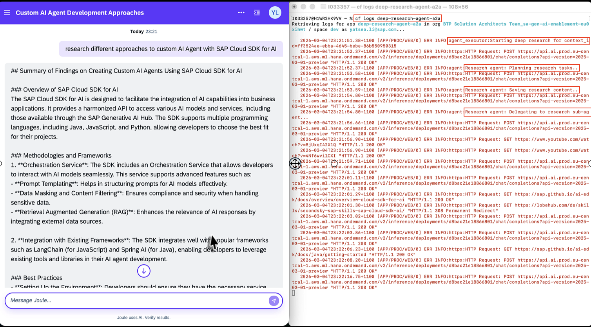

# Code-based Deep Research Agent Joule Integration through A2A

This sample code-based agent is a fork of the [deep research agent](https://github.com/langchain-ai/deepagents/tree/main/examples/deep_research) developed by langchain using the **langgraph deepagents SDK**. It has been adapted with the **SAP Generative AI Hub** via the **SAP Cloud SDK for AI** and integrates with [A2A](https://github.com/google-deepmind/a2a) using a custom Joule capability built with Joule Studio Code Editor.

The deep research agent plans and decomposes research topics from user requests, iteratively conducting multi-step research using **Tavily** for web search, parallel sub-agents and strategic reflection.

In addition, the sample also refer to the blog post about [Joule A2A: Connect Code Based Agents into Joule](https://community.sap.com/t5/technology-blog-posts-by-sap/joule-a2a-connect-code-based-agents-into-joule/ba-p/14329279) and its associated [Github Repo](https://github.com/fyx99/joule-pro-code-a2a) by [felixbartler](https://community.sap.com/t5/user/viewprofilepage/user-id/4997). It are recommended to go through the blog post for more details.

## Architecture

```
┌─────────────────────────────────────┐
│        Joule as A2A Client          │  deep_research_agent_capability
│  Custom Pro-Code Joule Capability   │
└───────────────┬─────────────────────┘
                │  HTTP  (A2A protocol)
                ▼
┌─────────────────────────────────────┐
│        A2A Starlette Server         │  app.py
│  AgentCard + AgentSkill metadata    │
└───────────────┬─────────────────────┘
                │
                ▼
┌──────────────────────────────────────┐
│     DeepResearchAgentExecutor        │  agent_executor.py
│  Manages A2A task lifecycle          │
│  (working → artifact → complete)     │
└───────────────┬──────────────────────┘
                │
                ▼
┌──────────────────────────────────────┐
│         DeepResearchAgent            │  agent.py
│  create_deep_agent via deepagents SDK│
│  and SAP Cloud SDK for AI            │
│                                      │
│  Orchestrator ──delegates─► Sub-agent│
│  (plan, synthesise, report) (search) │
└──────────────────────────────────────┘
```

## How it works

1. **User asks a research question** via Joule.
2. **Joule routes user request to Deep Research Agent** in Cloud Foundry through A2A
3. **Deep Research Agent plans** the research by creating a todo list.
4. **Deep Research Agent delegates** one or more parallel research tasks to the
   `research-agent` sub-agent.
5. **Sub-agent searches the web** using Tavily, reflects using `think_tool`,
   and returns structured findings with citations.
6. **Deep Research Agent synthesises** all findings, consolidates citations, and
   writes a comprehensive Markdown report.
7. **Deep Research Agent returns the final Report** as an A2A artifact (`research_report`) to the Joule for the user.


### Key files

| File | Purpose |
|------|---------|
| `app/agent.py` | `DeepResearchAgent` — builds the LangGraph multi-agent pipeline and exposes an async `stream()` method |
| `app/agent_executor.py` | `DeepResearchAgentExecutor` — A2A `AgentExecutor` that maps the agent's stream to A2A task events |
| `app/app.py` | A2A Starlette ASGI app with `AgentCard` and `AgentSkill` definitions |
| `app/manifest.yaml` | Cloud Foundry deployment manifest |
| `app/research_agent/` | Prompt templates and Tavily search tools |

### Environment variables

| Variable | Required | Description |
|----------|----------|-------------|
| `AICORE_AUTH_URL` | ✅ | SAP AI Core OAuth token endpoint |
| `AICORE_CLIENT_ID` | ✅ | SAP AI Core client ID |
| `AICORE_CLIENT_SECRET` | ✅ | SAP AI Core client secret |
| `AICORE_RESOURCE_GROUP` | ✅ | Resource group (default: `default`) |
| `AICORE_BASE_URL` | ✅ | SAP AI Core API base URL |
| `TAVILY_API_KEY` | ✅ | Tavily search API key |
| `AGENT_PUBLIC_URL` | ✅ | Public URL of this agent (used in AgentCard) |
| `MAX_RESEARCHER_ITERATIONS` | ❌ | Max round of research (default: `2`) |
| `MAX_CONCURRENT_RESEARCH_UNITS` | ❌ | Max researches in parallel (default: `3`) |
| `HOST` | ❌ | Server bind host (default: `0.0.0.0`) |
| `PORT` | ❌ | Server bind port (default: `10000`) |

## Prerequisites

- Python 3.11+
- Install [uv](https://docs.astral.sh/uv/) package manager
- An SAP AI Core instance with Generative AI Hub. by default, `gpt-4o-mini` model is used.
- An SAP Joule instance
- [Tavily](https://tavily.com) API key (free tier available)
- [Joule Studio Code Editor](https://help.sap.com/docs/joule/joule-development-guide-ba88d1ec6a1b442098863d577c19b0c0/joule-studio-code-editor) extension for Visual Studio Code, and the [Joule Studio CLI](https://help.sap.com/docs/joule/joule-development-guide-ba88d1ec6a1b442098863d577c19b0c0/joule-studio-cli)

## Local development

### 1. Install dependencies

```sh
cd 20-joule-a2a-code-based-agent/deep_research_a2a

# create a virtual env for 20-joule-a2a-code-based-agent
uv venv

# activate the virtual env
source .venv/bin/activate

# install the dependencies
cd app
uv pip install -r requirements.txt
```

### 2. Configure environment

```sh
cp .env.example .env
```

Edit .env and fill in your SAP AI Core and Tavily credentials etc.

### 3. Start the server

```sh
python app.py
```

The server starts at `http://localhost:10000`.

### 4. Verify the Agent Card

```sh
curl http://localhost:10000/.well-known/agent.json | jq .
```
It will return the agent card like this.
```json
{
  "capabilities": {
    "pushNotifications": true,
    "streaming": true
  },
  "defaultInputModes": [
    "text",
    "text/plain"
  ],
  "defaultOutputModes": [
    "text",
    "text/plain"
  ],
  "description": "An AI research assistant powered by SAP Generative AI Hub. Given a research question or topic, it autonomously plans, delegates web searches to specialised sub-agents, and produces a comprehensive, cited Markdown research report.",
  "name": "Deep Research Agent",
  "preferredTransport": "JSONRPC",
  "protocolVersion": "0.3.0",
  "skills": [
    {
      "description": "Conducts comprehensive web research on any topic using a multi-agent pipeline. Searches the web, analyses sources, synthesises findings, and returns a structured Markdown report with inline citations.",
      "examples": [
        "Research different approaches to custom AI agents with Joule Studio Agent Builder",
        "Compare the latest large language models from OpenAI, Anthropic, and Google",
        "Summarise the current state of quantum computing research",
        "Research best practices for SAP BTP application development"
      ],
      "id": "deep_research",
      "name": "Deep Research",
      "tags": [
        "research",
        "web search",
        "analysis",
        "report generation",
        "AI agents"
      ]
    }
  ],
  "url": "http://0.0.0.0:10000",
  "version": "1.0.0"
}
```
### 5. Test with test_client.py

```sh
BASE_URL=http://localhost:10000 python test_client.py
```

## Cloud Foundry deployment

### 1. Copy `manifest.template.yaml` as `manifest.yaml`
```sh
cd 20-joule-a2a-code-based-agent/deep_research_a2a/app
cp manifest.template.yaml manifest.yaml
```

Fill in all `<placeholder>` values with your actual SAP AI Core credentials, tavily-key and
the intended application URL.

### 2. Deploy

```sh
cf login
cf push
```

Obtain the deployment url e.g. https://<your-company-namespace>-deep-research-agent.cfapps.sap.hana.ondemand.com

### 3. Update AGENT_PUBLIC_URL environment variable with actual deployment URL in step 2

```sh
cf set-env <APP_NAME> AGENT_PUBLIC_URL <DEPLOYMENT_URL>
cf restage
```

### 4. Test and Verify the agent

```sh
BASE_URL=<DEPLOYMENT_URL> python test_client.py
```

If it succeeds, the following log will show as below.<br/>
INFO:__main__:Fetching public agent card from <DEPLOYMENT_URL>/.well-known/agent-card.json<br/>
INFO:httpx:HTTP Request: GET <DEPLOYMENT_URL>/.well-known/agent-card.json "HTTP/1.1 200 OK"

## Integrating the deep research agent with SAP Joule

In this section, we'll integrate the deep research agent with SAP Joule through a custom Joule capability with [Joule Studio Code Editor](https://help.sap.com/docs/joule/joule-development-guide-ba88d1ec6a1b442098863d577c19b0c0/joule-development?locale=en-US&version=CLOUD), which interacts with deep research agent through A2A(Agent-to-Agent) protocol.

### 1. Create a destination for the agent

In your SAP BTP Sub Account where Joule instance locates, create a destination named `deep-research-agent-a2a` for the deep research agent deployed in Cloud Foundry, which will be used in [joule capability-deep_research_agent_capability](./deep_research_agent_capability/capability.sapdas.yaml)
 for integration with Joule.

### 2. Compile and deploy the Joule capability `deep_research_agent_capability`

```sh
cd 20-joule-a2a-code-based-agent/deep_research_a2a
joule login
joule deploy -c  -n "deep_research_agent"
```

### 3. Launch the Joule and test with a research topic

```sh
# launch the Joule in web browser
joule launch deep_research_agent

# stream the logs of your deep_research_a2a application
cf logs <your-deep-research-agent-a2a>
```

Joule with a custom capability of deep_research_agent is launched in the default web browser.

Enter a research request e.g.<br/>
`research different approaches to custom AI agent with SAP Cloud SDK for AI`<br/>
`brainstorm the potential agentic AI use cases and opportunities in finance management SAP S/4HANA for SAP partner`<br/>
`find the solution to the issue about xxx`<br/>
...

### 3. Known limitation

A Joule dialog request has a default timeout of **60 seconds**, therefore, you may need to tune the environment variables below in `manifest.yaml` to accommodate the time frame.

```yaml
      # ----------------------------------------------------------------
      # Orchestrator limits (optional, defaults will be used if not set)
      # Joule dialog request has a default timeout of 60s,
      # so the orchestrator should be configured to ensure that all research units
      # complete within this time to avoid unexpected termination of the agent's response stream.
      # Adjust as needed based on the expected complexity of research tasks.
      # ----------------------------------------------------------------
      MAX_RESEARCHER_ITERATIONS: 2
      MAX_CONCURRENT_RESEARCH_UNITS: 3
```