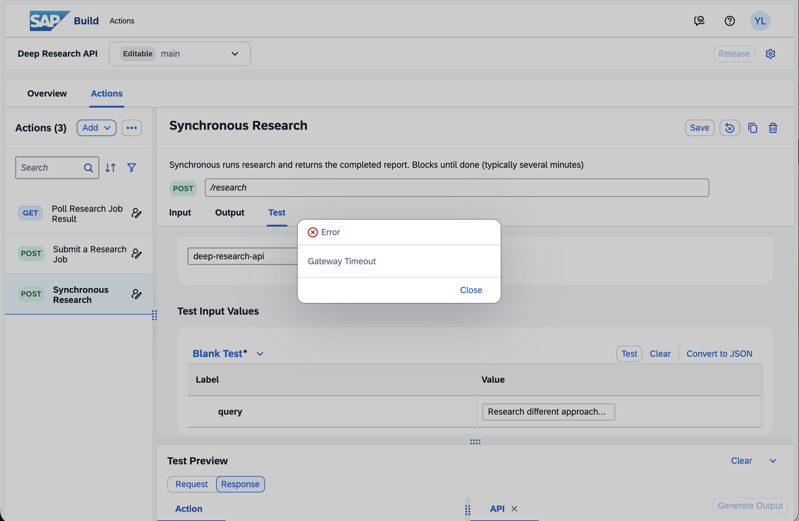
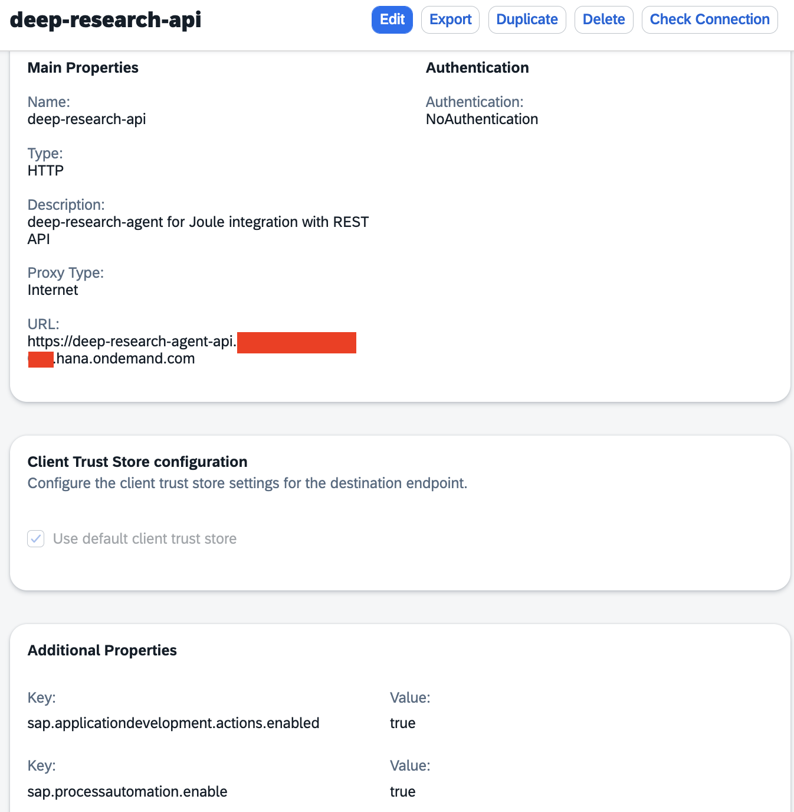
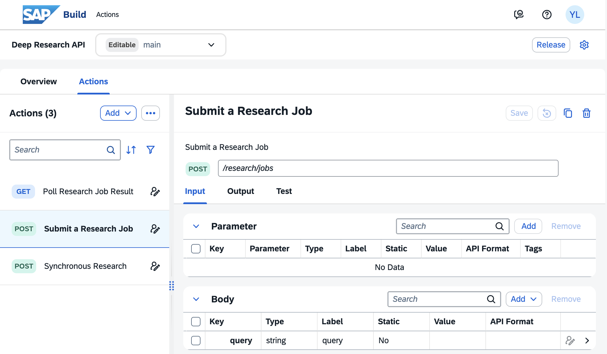
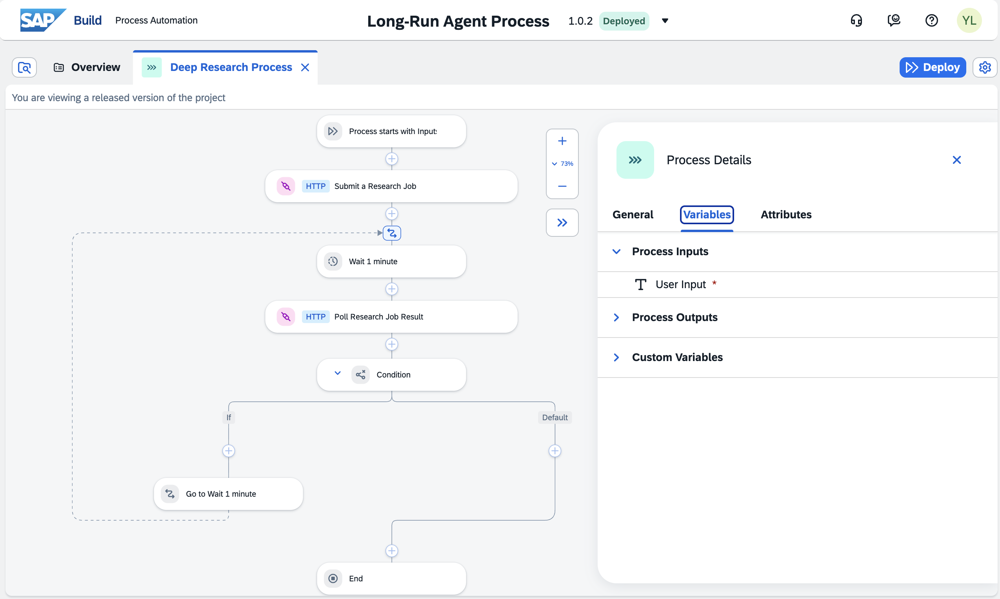
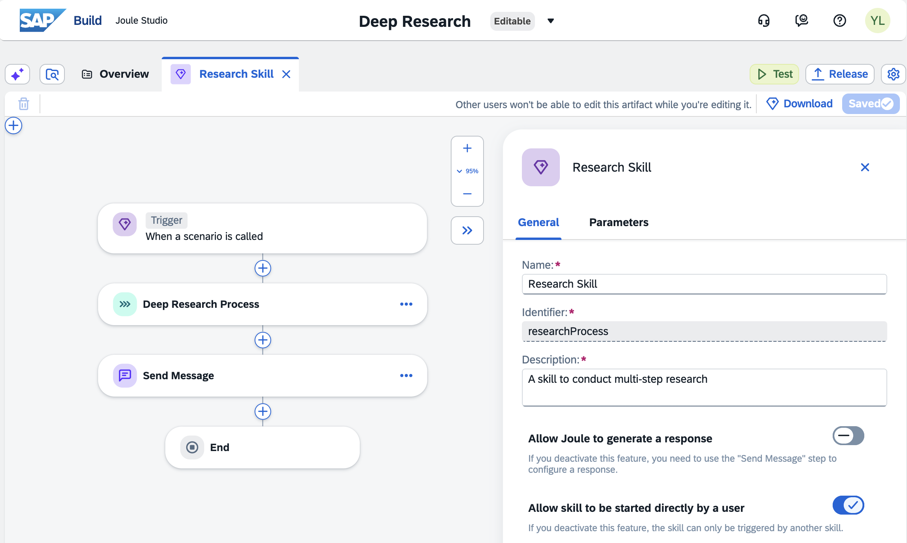
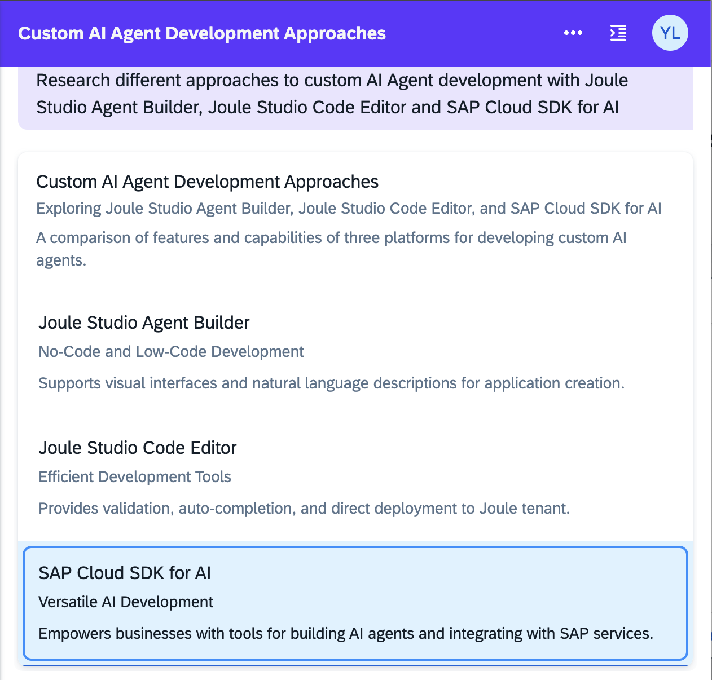
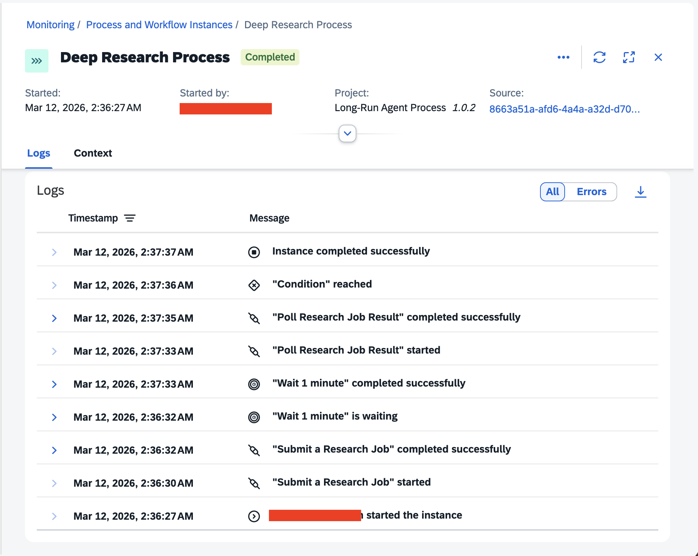
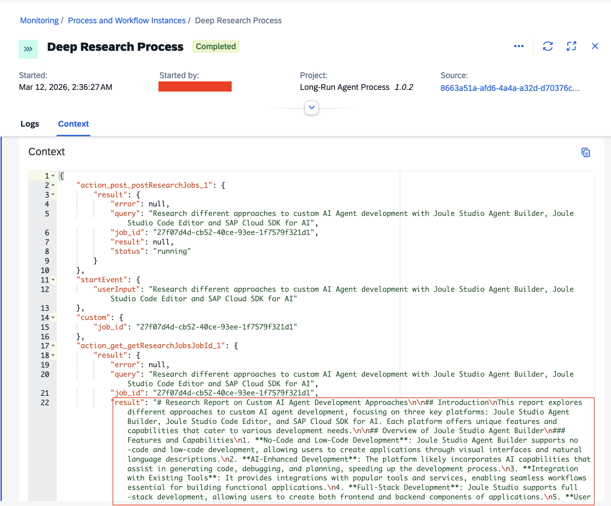

# Joule Integration with long-running Code-based Agent (Deep Research) through async REST API

This sample code-based agent is a fork of the [deep research agent](https://github.com/langchain-ai/deepagents/tree/main/examples/deep_research) developed by langchain using the **langgraph deepagents SDK**. It has been adapted with the **SAP Generative AI Hub** via the **SAP Cloud SDK for AI**, and exposed as a
**FastAPI REST API service** in both synchronous and asynchronous manner. Any application or agent can trigger deep research by calling the API. Especially, the asynchronous API will be helpful when the deep research agent may conduct a **long-running**(> 1 min) research.

The deep research agent plans and decomposes research topics from user requests, iteratively conducting multi-step research using **Tavily** for web search, parallel sub-agents and strategic reflection.

## Architecture

```
┌─────────────────────────────────────┐
│        API Client / Agent           │
│  (any HTTP client)                  │
└───────────────┬─────────────────────┘
                │  HTTP  (REST / JSON)
                ▼
┌─────────────────────────────────────┐
│         FastAPI Application         │  app.py
│                                     │
│  POST /research          (sync)     │
│  POST /research/jobs     (async)    │
│  GET  /research/jobs/:id (poll)     │
└───────────────┬─────────────────────┘
                │
                ▼
┌──────────────────────────────────────┐
│         DeepResearchAgent            │  agent.py
│  create_deep_agent via deepagents SDK│
│  and SAP Cloud SDK for AI            │
│                                      │
│  Orchestrator ──delegates─► Sub-agent│
│  (plan, synthesise, report) (search) │
└──────────────────────────────────────┘
```

## Technical Details

### Process flow

1. **Client sends a research query** via `POST /research`(synchronous API)  or `POST /research/jobs`(asynchronous API).
2. **Deep Research Agent plans** the research by creating a todo list.
3. **Deep Research Agent delegates** one or more parallel research tasks to the
   `research-agent` sub-agent.
4. **Sub-agent searches the web** using Tavily, reflects using `think_tool`,
   and returns structured findings with citations.
5. **Deep Research Agent synthesises** all findings, consolidates citations, and
   writes a comprehensive Markdown report.
6. **Report is returned** in the API response or stored in the job store for polling.

### Environment variables

| Variable | Required | Description |
|----------|----------|-------------|
| `AICORE_AUTH_URL` | ✅ | SAP AI Core OAuth token endpoint |
| `AICORE_CLIENT_ID` | ✅ | SAP AI Core client ID |
| `AICORE_CLIENT_SECRET` | ✅ | SAP AI Core client secret |
| `AICORE_RESOURCE_GROUP` | ✅ | Resource group (default: `default`) |
| `AICORE_BASE_URL` | ✅ | SAP AI Core API base URL |
| `TAVILY_API_KEY` | ✅ | Tavily search API key |
| `MODEL_NAME` | ✅ | The target LLM in SAP Generative AI Hub (default: `gpt-4o-mini`) |
| `MAX_RESEARCHER_ITERATIONS` | ❌ | Max round of research (default: `2`) |
| `MAX_CONCURRENT_RESEARCH_UNITS` | ❌ | Max researches in parallel (default: `3`) |
| `SUPPLIER_API_URL` | ❌ | Ariba OData supplier search endpoint (default: `https://xyz.hana.ondemand.com/Ariba_SearchSupplier/Suppliers`) |
| `SUPPLIER_AUTH_URL` | ❌ | OAuth 2.0 token endpoint for the supplier API (default: `https://xyz.authentication.eu10.hana.ondemand.com`) |
| `SUPPLIER_CLIENT_ID` | ❌ | Client ID for supplier API authentication |
| `SUPPLIER_CLIENT_SECRET` | ❌ | Client secret for supplier API authentication |
| `HOST` | ❌ | Server bind host (default: `0.0.0.0`) |
| `PORT` | ❌ | Server bind port (default: `10000`) |

### API endpoints

| Method | Path | Description |
|--------|------|-------------|
| `POST` | `/research` | **Synchronous** — runs research and returns the completed report. Blocks until done (typically several minutes). |
| `POST` | `/research/jobs` | **Asynchronous** — submits a research job, returns a `job_id` immediately (HTTP 202). |
| `GET` | `/research/jobs/{job_id}` | Poll job status (`running` / `completed` / `failed`) and retrieve the result. |

#### Request body (both `POST` endpoints)

```json
{ "query": "Research the latest advances in AI agent frameworks" }
```

#### Synchronous response

```json
{
  "query": "Research the latest advances in AI agent frameworks",
  "result": "# Research Report\n...",
  "status": "completed"
}
```

#### Async job submission response (HTTP 202)

```json
{
  "job_id": "3f4a1b2c-...",
  "query": "Research the latest advances in AI agent frameworks",
  "status": "running"
}
```

#### Job status / result response

```json
{
  "job_id": "3f4a1b2c-...",
  "query": "Research the latest advances in AI agent frameworks",
  "status": "completed",
  "result": "# Research Report\n...",
  "error": null
}
```

### Key files

| File | Purpose |
|------|---------|
| `app/agent.py` | `DeepResearchAgent` — builds the LangGraph multi-agent pipeline and exposes `stream()` and `run()` methods |
| `app/app.py` | FastAPI application with sync and async research endpoints |
| `app/manifest.yaml` | Cloud Foundry deployment manifest |
| `app/research_agent/` | Prompt templates and Tavily search tools |

### Prerequisites

- Python 3.11+
- Install [uv](https://docs.astral.sh/uv/) package manager
- An SAP AI Core instance with Generative AI Hub. by default, `gpt-4o-mini` model is used.
- [Tavily](https://tavily.com) API key (free tier available)

### Local development

#### 1. Install dependencies

```sh
cd 20-joule-a2a-code-based-agent/deep_research_api

# create a virtual env for 20-joule-a2a-code-based-agent
uv venv

# activate the virtual env
source .venv/bin/activate

# install the dependencies
cd app
uv pip install -r requirements.txt
```

#### 2. Configure environment

```sh
cp .env.example .env
```

Edit .env and fill in your SAP AI Core and Tavily credentials

#### 3. Start the server

```sh
python app.py
```

The server starts at `http://localhost:10000`. Interactive API docs are available at
`http://localhost:10000/docs`.

#### 4. Run synchronous research

```sh
curl -X POST http://localhost:10000/research \
  -H "Content-Type: application/json" \
  -d '{"query": "Research the latest advances in AI agent frameworks"}'
```

#### 5. Run asynchronous research

```sh
# Submit job
curl -X POST http://localhost:10000/research/jobs \
  -H "Content-Type: application/json" \
  -d '{"query": "Research the latest advances in AI agent frameworks"}'

# Periodically poll result (replace <job_id> with the returned job_id). 
# e.g. repeat every 10 second until the job status become completed
curl http://localhost:10000/research/jobs/<job_id>
```

#### 6. Run the test client

```sh
python test_client.py
```

### Cloud Foundry deployment

#### 1. Copy `manifest.template.yaml` as `manifest.yaml`

```sh
cd 20-joule-a2a-code-based-agent/deep_research_api/app
cp manifest.template.yaml manifest.yaml
```

Fill in all `<placeholder>` values with your actual SAP AI Core credentials, tavily-key etc.

#### 2. Deploy

```sh
cf login
cf push
```

Obtain the deployment URL, then you can use it in any http client.

## The challenges of integrating long-running code-based agent(BYOA) with Joule

### 1. Joule's 60 seconds timeout for synchronous communication with BYOA through A2A

As highlighted in [the official help centre of Joule Studio here](https://help.sap.com/docs/Joule_Studio/45f9d2b8914b4f0ba731570ff9a85313/2f9701e60fd24e948c2c74fe9e55ce23.html?locale=en-US&state=PRODUCTION&version=SHIP), `With synchronous communication, Joule expects the response from agent server in < 60 seconds.`.

### 2. Action's timeout quota

According [the official quota of Action tasks](https://help.sap.com/docs/Joule_Studio/45f9d2b8914b4f0ba731570ff9a85313/e29bb9c5fb1841b2b61f59b874ca0edd.html?locale=en-US&state=PRODUCTION&version=SHIP), a synchronous API call to BYOA through Action project may hit connection timeout(1 minutes),  socket timeout(gateway timeout for 3 minutes) etc.


## The solutions of integrating long-running code-based agent(BYOA) with Joule

In conclusion,  the viable approaches of integrating a long-running agent with **SAP Joule** must be through such asynchronous communication. However, it is important to note that the following solutions are only applicable to those long-running  within a **5 minutes** timeframe.

### Option 1 - Pro-Code Agent with Joule Studio Code Editor <-> Asynchronous API Request <-> Agent API

Please refer to help document about [Asynchronous API Request](https://help.sap.com/docs/Joule_Studio/45f9d2b8914b4f0ba731570ff9a85313/0c63b8dacc12451cb98b71ddf16b4bf0.html?locale=en-US).

DO READ its Platform requirement and Technical Prerequisites carefully.

- Bi-directional communication (callback support) is currently only supported for **IAS-based integrations**.
- **Non-IAS-based** integrations are **not yet compatible** with this asynchronous callback model.

### Option 2 - Content-based Agent with Joule Studio <-> Process <-> Agent Asynchronous API

The following steps is ought to be performed in SAP BTP Sub Account where SAP Build Process Automation resides.  

#### 1. Create a destination for the Deep Research Agent's REST APIs



| Properties | Values |
|------|---------|
| Name | deep-research-api |
| Type | http |
| Description | deep-research-agent for Joule integration with REST API |
| URL | the deployment URL of deep-research-api application on Cloud Foundry |
| sap.applicationdevelopment.actions.enabled | true |
| sap.processautomation.enable | true |

#### 2. Create an Action Project for the Deep Research Agent's REST APIs


As the APIs are REST format, therefore you will need to create the action from scratch.

##### Action 1: Submit Research Job

| Properties | Values |
|------|---------|
| Name | Submit Research Job |
| Http Method | POST |
| Endpoint | /research/jobs |
| Description | Submit a Research Job, and return its job_id |
| Input Body | sample json `{ "query": "Research the latest advances in AI agent frameworks" }` |
| Output Body | sample json `{ "job_id": "3f4a1b2c-...", "query": "Research the latest advances in AI agent frameworks", "status": "running"}` |

##### Action 2: Poll Research Job Result

| Properties | Values |
|------|---------|
| Name | Poll Research Job Result |
| Http Method | GET |
| Endpoint | /research/jobs/{job_id} |
| Description | Poll job status (running / completed / failed) and retrieve the result. |
| Input Parameter | Key: job_id, Parameter: **path**, Type: string |
| Output Body | sample json `{  "job_id": "3f4a1b2c-...", "query": "Research the latest advances in AI agent frameworks","status": "completed", "result": "# Research Report\n...","error": null}` |

##### Action 3: Synchronous Research

| Properties | Values |
|------|---------|
| Name | Synchronous Research |
| Http Method | POST |
| Endpoint | /research |
| Description | Synchronous runs research and returns the completed report. Blocks until done (typically several minutes) |
| Input Parameter | Key: job_id, Parameter: path, Type: string |
| Output Body | sample json `{  "job_id": "3f4a1b2c-...", "query": "Research the latest advances in AI agent frameworks","status": "completed", "result": "# Research Report\n...","error": null}` |

Make sure you have tested the actions with the destination deep-research-api created in step 1. Once it all works as required, then release and publish the Action project

#### 3. Create a Process to orchestrate the research job submission and polling its result every minute



| Properties | Values |
|------|---------|
| Name | Deep Research Process |
| Description | A process to invoke remote Deep Research Agent through async REST api |
| Process Input | Name: User Input, Type: string |
| Process Output | Name: Research Report, Type: string |
| The condition  of looping | job.result.status == 'running' |

You can import the [Research Process artifact](./artifacts/Long-Run%20Agent%20Process.mtar) through SAP Build Process Automation Lobby

#### 4. Create a Skill to trigger the process


You can import the [Research Skill artifact](./artifacts/Long-Run%20Agent%20Process.mtar) through SAP Build Process Automation Lobby

#### 5. Deploy the skill

The skill must be deployed to the same environment as the Deep Research Process in step 3.

#### 6. Launch and test the skill

Once the joule client is launched, you can enter a research task like
`Research different approaches to custom AI Agent development with Joule Studio Agent Builder, Joule Studio Code Editor and SAP Cloud SDK for AI`


It will trigger the process, which can be monitored through Control Tower > Monitoring > Proeess and Workflow Instances

